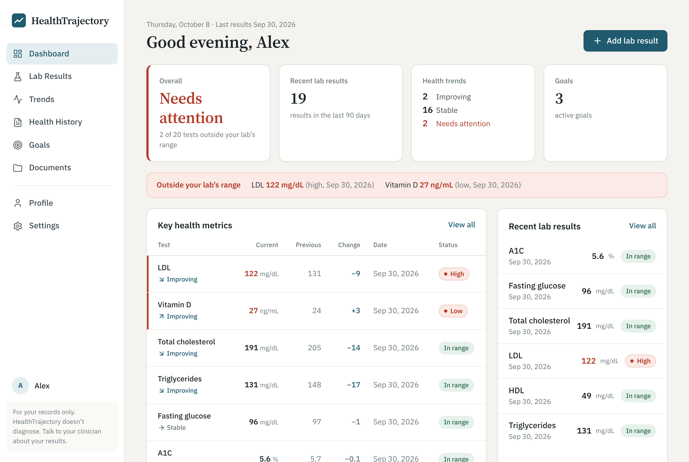

# HealthTrajectory

Track your lab results over time and see which way they're heading.

HealthTrajectory lets you enter results from your lab reports (cholesterol, A1C, glucose, kidney function and more) and shows, in plain language, whether each one is in range, improving, worsening or holding steady, so you can walk into your next appointment with clear questions.



> **Educational only.** HealthTrajectory does not diagnose or give medical advice. The data shown above is made up.

## Features

- **Lab results**: add one test or a full panel (lipid, CMP, CBC, thyroid, and others), using the normal range printed on *your* report
- **Trends**: every test labeled Improving, Worsening, Stable or Needs attention, with charts
- **Dashboard**: overall status, out-of-range alerts and key metrics at a glance
- **Goals**: lab goals (e.g. "LDL below 100") that track themselves, plus habit goals
- **Health history**: conditions, medications, allergies, procedures, family history, immunizations
- **Documents**: keep PDFs and photos of lab reports in one place
- **Export / import**: download your data as a file at any time

## Quick start

Already have Git and Node.js? Run:

```bash
cd capstone
npm install
npm run dev
```

Then open http://localhost:5173. On the dashboard, click **Load example data** to explore with made-up results.

```bash
npm test         # run the tests
npm run build    # production build
```

**New to any of this?** Follow the [step-by-step guide for beginners](#beginners-guide-visual-studio-code) below.

> ⚠️ **Don't use VS Code's "Go Live" / Live Server button.** It shows a blank page. This app is written in TypeScript/React, which the browser can't read directly. `npm run dev` translates it on the fly, and Live Server doesn't. Always use `npm run dev` and open **http://localhost:5173**.

## Built with

React · TypeScript · Vite · React Router

## Project status

- **Now:** a working web app. Data is stored only in the user's browser, and nothing is sent to a server. Sign-in is a placeholder, not real authentication.
- **Next:** a SQL Server database and back-end API for real accounts and data that follows you across devices.

## Repository layout

| Path | What's there |
|---|---|
| [`capstone/`](capstone/) | The web app ([technical README](capstone/README.md)) |
| [`capstone/src/lib/analysis.ts`](capstone/src/lib/analysis.ts) | How status and trends are calculated |
| [`capstone/docs/reference-ranges.md`](capstone/docs/reference-ranges.md) | Sources for typical ranges |
| [`docs/Team_B_Project_Plan.xlsx`](docs/Team_B_Project_Plan.xlsx) | Project plan: every task, who owns it, dates and dependencies |
| [`team/`](team/) | A folder for each team member: their personal guide (`README.md`) and their journal (`journal.md`) |

## Team

Capstone Team B. Everyone works on **their own branch** and moves finished work into `main` with a pull request.

| Member | Your branch | Your folder (guide + journal) |
|---|---|---|
| Tony | `tony-branch` | [`team/Tony/`](team/Tony/) |
| Jared | `jared-branch` | [`team/Jared/`](team/Jared/) |
| Rob | `rob-branch` | [`team/Rob/`](team/Rob/) |
| Carlos | `carlos-branch` | [`team/Carlos/`](team/Carlos/) |

Each person's folder has a **`README.md`** (your personal step-by-step guide, with your branch filled in) and a **`journal.md`** where you can log what you worked on. Only edit files in **your own** folder, so nobody's journal ever conflicts with anyone else's. You can add more files there too (notes, screenshots, research).

> 🔒 **`main` is protected.** Teammates can't push to it directly, and everyone (Tony included) moves work into `main` through a pull request. This stops anyone from accidentally overwriting someone else's work.

> ⚠️ **Read the [Dos and don'ts](#dos-and-donts) before your first commit.** This repo is **public**: anything you push can be seen by anyone on the internet, and it stays in the history even after you delete it.

---

## Beginner's guide (Visual Studio Code)

Never used Git, GitHub or VS Code before? Start here. You only do **Part 1** and **Part 2** once. **Part 3** and **Part 4** are what you do every time you work on the project. Your [personal guide](#team) has the same steps with your branch name filled in.

> **Mac or Windows?** Where this guide says **Cmd**, Windows users press **Ctrl**. Where it says **Option**, Windows users press **Alt**.

### Part 1: Install the tools (one time)

| Step | What to do |
|---|---|
| 1. **GitHub account** | Sign up at [github.com](https://github.com) if you don't have one. Send your username to Tony so Tony can add you to the project. You **can't push changes** until you're added (see the box below). |
| 2. **VS Code** | Download from [code.visualstudio.com](https://code.visualstudio.com) and install it. |
| 3. **Git** | **Mac:** open the **Terminal** app, type `git --version` and press Enter. If it asks to install "command line developer tools", click **Install**. **Windows:** download from [git-scm.com](https://git-scm.com) and install with all the default options. |
| 4. **Node.js** | Download the **LTS** version from [nodejs.org](https://nodejs.org) and install it. This is what runs the app. |
| 5. **Restart VS Code** | Close VS Code completely and reopen it so it can find Git and Node. |

> **Tony — adding a teammate:** on GitHub, open this repo → **Settings** → **Collaborators** → **Add people** → type their username. They'll get an email invite they have to **accept**.

**Tell Git who you are** (one time). In VS Code, open the menu **Terminal → New Terminal**. Type these four lines, pressing Enter after each. Put your own name, and the **same email you used for GitHub**, in the first two:

```bash
git config --global user.name "Your Name"
git config --global user.email "you@example.com"
git config --global pull.rebase false
git config --global core.pager cat
```

The last two lines prevent two confusing messages later (see Troubleshooting). Nothing will print; that means it worked. Since this repo is public, your email shows on your commits. To keep it private, use the `...@users.noreply.github.com` address from GitHub → **Settings** → **Emails** (turn on **Keep my email addresses private**).

### Part 2: Get the project onto your computer ("clone") (one time)

1. Open VS Code. If a project is already open, close it with **File → Close Folder**.
2. Press **Cmd + Shift + P**, type **Git: Clone**, and press Enter.
3. Choose **Clone from GitHub**. If it asks you to sign in to GitHub, click **Allow** and finish signing in in your browser.
4. Choose **TonyT513/healthtrajectory**. (Or paste `https://github.com/TonyT513/healthtrajectory.git`.)
5. Pick a folder to save it in, such as **Documents**. Avoid saving it inside OneDrive or iCloud folders.
6. When VS Code asks **"Would you like to open the cloned repository?"**, click **Open**.
7. If it asks **"Do you trust the authors?"**, click **Yes, I trust the authors**.

You should now see `capstone`, `docs` and `README.md` in the **Explorer** panel on the left.

**Switch to your own branch (one time).** Look at the **bottom-left corner** of VS Code; it says `main`. Click it. In the list that opens at the top, choose **`origin/yourname-branch`** (e.g. `origin/carlos-branch`). The bottom-left now shows your branch name. ✅ From now on, VS Code remembers it.

### Part 3: Run the app

1. Open a terminal: **Terminal → New Terminal**. It appears at the bottom of VS Code.
2. Type these, pressing Enter after each:

   ```bash
   cd capstone
   npm install
   npm run dev
   ```

   - `cd capstone` moves into the app's folder. You must do this first.
   - `npm install` downloads the libraries the app needs. It takes a minute and you only need it the first time, or after someone adds a new library. Yellow "warn" messages are normal.
   - `npm run dev` starts the app. **Leave this terminal running** while you use the app.
3. When you see `Local: http://localhost:5173/`, hold **Cmd** and click that link, or type it into your browser.
4. Click **Create an account** (it's only saved on your computer), then **Load example data** to see the app filled in.
5. While it's running, any code you save shows up in the browser automatically.
6. To **stop** the app: click in the terminal and press **Control + C** (on Mac too, it's the Control key, not Cmd).

Next time, you only need `cd capstone` and `npm run dev`.

### Part 4: Your everyday routine (your branch → pull request → `main`)

How the team works:

```
tony-branch   ──┐
jared-branch  ──┤
rob-branch    ──┼──→  Pull request  →  Merge  →  main  (the team's official copy)
carlos-branch ──┘
```

- **`main`** = the team's official copy. **Never work on it directly** (GitHub will block you anyway).
- **`yourname-branch`** = your personal workspace. Push to it as often as you like; you can't break anyone else's work there.
- **Pull request (PR)** = how you move finished work from your branch into `main`. It shows exactly what you changed.

#### Every time you sit down to work

1. **Check the bottom-left of VS Code says your branch** (e.g. `carlos-branch`). If it says `main`, click it and pick your branch.
2. **Get the team's latest work into your branch.** Open the terminal and run:
   ```bash
   git pull origin main
   ```
   This brings everything new from `main` into your branch. If it opens an editor with a message, just close that tab.
3. **Make your changes** and save (**Cmd + S**). Test them in the app (Part 3).
4. **Commit.** Click the **Source Control** icon on the left (three dots joined by lines). **Look at the list of changed files first** and make sure every file belongs there (see [Dos and don'ts](#dos-and-donts)). Type a short message like `Add sleep goal to Goals page` and click **✓ Commit**.
   - If it asks *"There are no staged changes… stage all your changes?"*, click **Yes**.
5. **Push.** Click **Sync Changes** (or **Publish Branch** the first time). Your work is now backed up on GitHub, on your branch only.

Repeat steps 3–5 as often as you like. Small, frequent commits are best.

#### When a piece of work is finished: open a pull request

1. Do steps 2 and 5 above once more, so your branch has the latest `main` and everything is pushed.
2. Go to [the repo on GitHub](https://github.com/TonyT513/healthtrajectory). Click the yellow **Compare & pull request** banner.
   *No banner?* Click the **Pull requests** tab → **New pull request** → set **base: `main`** and **compare: `yourname-branch`**.
3. Give it a clear title (e.g. *Goals page: add sleep goal*) and a sentence about what changed. Click **Create pull request**.
4. Look at the **Files changed** tab. Is everything there something you meant to change? If not, fix it on your branch and push again; the PR updates itself.
5. If GitHub says **"This branch has no conflicts with the base branch"**, click **Merge pull request** → **Confirm merge**. 🎉 Your work is in `main`.
   - If it says there are **conflicts**, don't guess. Ask the teammate who changed the same file, or ask Tony.
6. ❗ GitHub then offers a **Delete branch** button. **Don't click it.** Your branch is your permanent workspace. (If it was deleted by accident, Tony can restore it from the closed pull request.)
7. Tell the team in the group chat: "Merged my PR, please run `git pull origin main`."

#### The same thing using only the terminal

```bash
git switch yourname-branch            # make sure you're on your branch
git pull origin main                  # get the team's latest work
# ... edit, save and test ...
git status                            # check which files changed (read the list!)
git add .                             # include your changes
git commit -m "Describe what you changed"
git push                              # send it to YOUR branch on GitHub
# then open the pull request on github.com (steps above)
```

#### Team tips

- **Say what you're working on** in the group chat so two people don't change the same file at once. That's the main cause of conflicts.
- **Run `git pull origin main` at the start of every session**, so your branch never falls far behind.
- **Commit small and often**, and merge into `main` when a feature works, not once a month.
- **Test before you open a PR**: the app should start with `npm run dev` and the page you changed should work.

### Dos and don'ts

> ⚠️ **Read this before your first commit.**

This repository is **public**. Everything you push can be seen by anyone, and **deleting a file later does not remove it**: it stays in the Git history forever. Before every commit, read the list of changed files in Source Control.

**✅ Do:**

| ✅ Do | Why |
|---|---|
| **Work on your own branch** (`yourname-branch`) | You can save and push as often as you like without affecting anyone else. |
| **Run `git pull origin main` at the start of every session** | Your branch gets everyone's latest work, so you build on the current code and avoid big conflicts later. |
| **Read the list of changed files before every commit** | It's your last chance to catch a file that shouldn't be there, like a password or a stray test file. |
| **Write clear commit messages** (e.g. `Add sleep goal to Goals page`) | The team, your instructor and future you can see what changed and why, and find it quickly. |
| **Commit small and often** | Small commits are easy to understand and easy to undo if something goes wrong. |
| **Test before opening a pull request** (`npm run dev`, check your page) | Whatever reaches `main` is what everyone gets. Broken code there breaks it for the whole team. |
| **Check "Files changed" on your pull request** | Confirms you're only adding what you meant to, before it joins the official copy. |
| **Say in the group chat what you're working on** | Two people editing the same file at the same time is the #1 cause of conflicts. |
| **Use only made-up example data** (the app's **Load example data**) | Keeps real people's private health information out of a public repo. |
| **Keep personal notes in your own folder** (`team/YourName/`) | Your journal and notes never clash with anyone else's files. |
| **Ask when you're unsure** | A 2-minute question is faster than untangling lost work. |

**❌ Never commit:**

| ❌ Don't commit | Why |
|---|---|
| **Passwords, API keys, tokens, connection strings**, or any `.env` file | Anyone can copy and misuse them. Bots scan GitHub for keys within minutes. See [Where secrets go instead](#where-secrets-go-instead). |
| **Real health information**: anyone's real lab results, medications, diagnoses, or screenshots of real data | Private medical information. Use only the app's **made-up example data**. |
| **Personal information**: SSNs, student IDs, home addresses, phone numbers, birthdates | Public forever, even after deletion. |
| **`node_modules/`, `dist/`** | Huge, and anyone can recreate them with `npm install` / `npm run build`. (Already blocked by `.gitignore`.) |
| **Big files** (videos, `.zip` files, anything over ~10 MB) | Slows down everyone's clone. GitHub rejects files over 100 MB. |
| **System junk**: `.DS_Store`, `__MACOSX/`, `Thumbs.db` | Clutter from Mac/Windows. (Already blocked by `.gitignore`.) |
| **Code, images or text you don't have the right to use** | Copyright. Note the source of anything you borrow. |

**❌ Never do:**

| ❌ Don't | Why |
|---|---|
| Work directly on `main` | It's the team's official copy. Use your own branch. |
| Use `git push --force` (or "Force Push") | It can erase other people's work. |
| Delete someone else's branch, or your own after merging | Branches are each person's workspace. |
| Merge a PR with conflicts you don't understand | You might throw away a teammate's work. Ask first. |
| Commit code that doesn't run | It breaks the app for everyone once it reaches `main`. |
| Edit files in someone else's `team/` folder, or change their code without telling them | Leads to conflicts and lost work. |

### Where secrets go instead

You'll eventually need things like a database password or an API key. Here's how to handle them without ever putting them in the repo:

| ✅ Do this | Why |
|---|---|
| **Put secrets in a file named `.env`** (inside `capstone/`, or wherever the code that needs them lives) | `.gitignore` already blocks every `.env` file, so Git won't upload it even if you run `git add .`. |
| **Commit a `.env.example`** with the same names but fake values, e.g. `DB_PASSWORD=your-password-here` | Teammates can see which settings they need without seeing the real values. They copy it to `.env` and fill in their own. |
| **Read the value in code by its name**, never type the actual value into a code file | The code can be public; the value stays on your computer. |
| **Share real secrets privately**: a direct message, in person, or a password manager | Not in the group chat history, not in a journal, not in a GitHub issue or pull request. |
| **Keep real secrets on a server, never in the browser app.** When the back end exists, the database password lives only there. When deploying, enter secrets in the host's settings (e.g. Vercel → Project → Settings → **Environment Variables**). | Anything the browser app uses can be read by anyone who opens the website, even if it came from `.env`. |
| **Check the changed-files list before committing** | If you ever see a file named `.env` (without `.example`) there, stop: something is wrong. |

### Troubleshooting

| What you see | What to do |
|---|---|
| **Blank white page** at `127.0.0.1:5500` | You used Live Server. Stop it (click **Port: 5500** at the bottom of VS Code) and use `npm run dev` with **http://localhost:5173** instead. |
| **Blank page** at `localhost:5173` | Make sure the `npm run dev` terminal is still running. Press **Cmd + Shift + R** to hard-refresh. Still blank? Press **Cmd + Option + J** (Chrome) to see errors and send them to the team. |
| `npm: command not found` / `'npm' is not recognized` | Node.js isn't installed, or VS Code was open while you installed it. Install the LTS version from nodejs.org and **restart VS Code**. |
| `npm.ps1 cannot be loaded because running scripts is disabled on this system` (Windows) | Run `Set-ExecutionPolicy -Scope CurrentUser RemoteSigned` in the VS Code terminal and type **Y** if asked. Or switch the terminal to Command Prompt: **Ctrl + Shift + P** → **Terminal: Select Default Profile** → **Command Prompt**, then open a new terminal. |
| `npm error enoent ... package.json` | You're in the wrong folder. Run `cd capstone` first. |
| `Port 5173 is in use` | The app is already running in another terminal. Use that one, or stop it with **Control + C**. |
| `git: command not found` | Git isn't installed. See Part 1, then restart VS Code. |
| `Need to specify how to reconcile divergent branches` | Run `git config --global pull.rebase false`, then `git pull` again. |
| `Please tell me who you are` | Run the `git config` lines in Part 1. |
| `protected branch` / `GH006` / `Changes must be made through a pull request` when pushing | You're on `main`. Click the branch name at the bottom-left of VS Code → choose your branch. To move uncommitted changes, just switch (they come with you). If you already committed on `main`, ask Tony for help. |
| Your branch isn't in the list when switching | Your copy doesn't know about it yet. Press **Cmd + Shift + P** → **Git: Fetch**, then try again. |
| `rejected ... fetch first` / `Updates were rejected` | Someone (or you, from another computer) pushed to your branch first. Run `git pull`, then `git push` again. |
| `Permission denied` / `403` when pushing | Either you haven't **accepted** the collaborator invite (check your email or github.com/notifications), or VS Code isn't signed in to GitHub (click the **person icon** at the bottom-left → sign in with GitHub). |
| A screen ending with `(END)` or `:` that won't go away | Press **q**. To stop it happening, run `git config --global core.pager cat`. |
| A text editor opens saying **"Please enter a commit message"** or **MERGE_MSG** | Git is confirming a pull. Just close that editor tab; if asked, save it. In a terminal editor (vim), type `:wq` and press Enter. |
| **Merge conflict** (files marked **C** or `<<<<<<<` in the code) | You and a teammate changed the same lines. Open the file; VS Code shows **Accept Current Change** (yours), **Accept Incoming Change** (theirs) or **Accept Both**. Pick the right one, save, then commit and push. This usually happens after `git pull origin main`. If you're unsure, ask the teammate who made the other change before choosing. |
| Everything is a mess and you just want a fresh copy | Rename your old project folder (so nothing is lost), then do **Part 2** again. |
